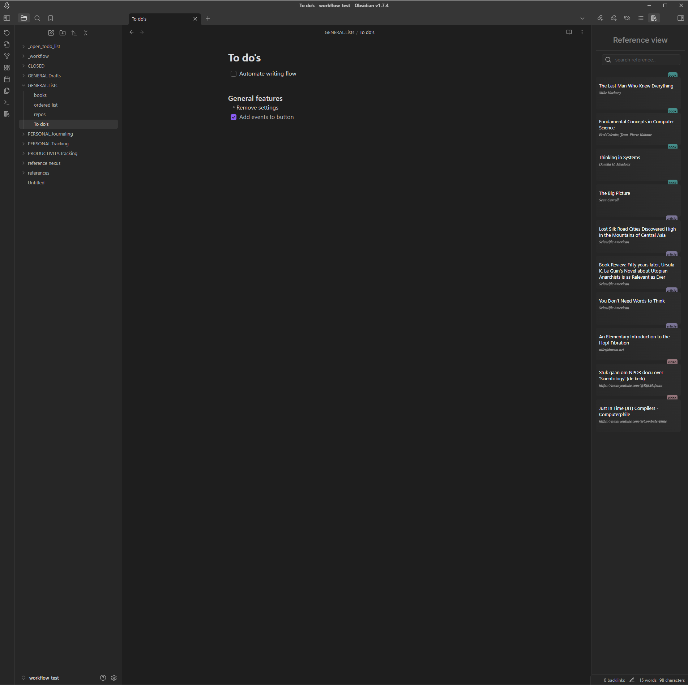

# Reference Nexus

To search for references in public databases, you will have to provide your own API keys. The link to the guide is provided in the settings. If, for some reason, you do not want to create API keys, there is also the possibility to manually add references to your local reference database.

You can add a reference by using the "Add reference" command in the menu.

## Reference view

The main feature of the plugin is the reference view, which is the interface that allows you to delete, update and track your references.

